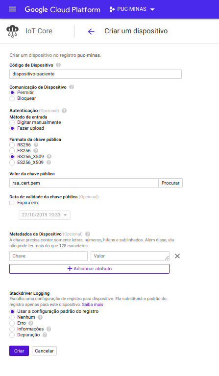
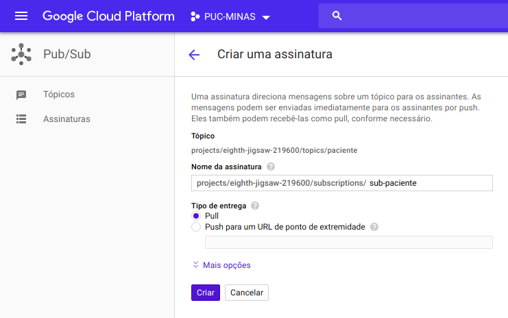
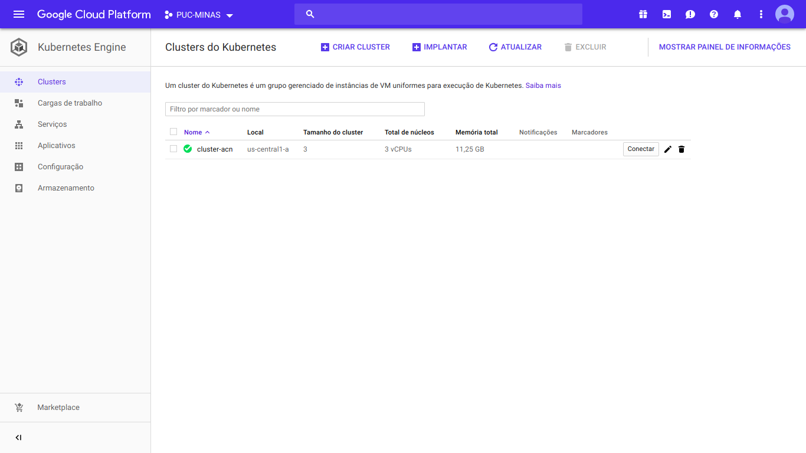
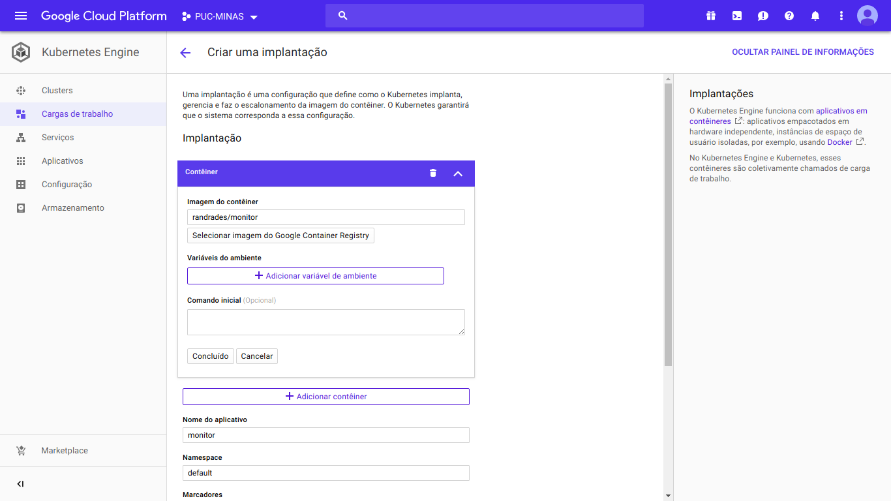
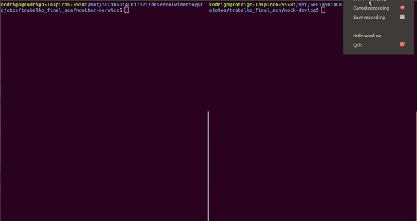

# Arquitetura de Nuvem


## Sistema Hospitalar

Você irá fazer uma prova de conceito que deve usar os serviços Docker e Kubernetes para emular a monitoração de dados vitais de pacientes.
Você pode criar um emulador de dados do paciente (mock), que irá emitir sinais como se fosse um paciente real. Esse emulador deve ser cadastrado como um dispositivo IoT dentro de uma plataforma de nuvem da sua escolha (Google Cloud, AWS ou Azure).

E você irá codificar um microsserviço em uma linguagem da sua escolha que irá operar sobre o Docker e Kubernetes e que deve monitorar o emulador de dados do paciente. Caso os parâmetros de pressão arterial, troca de gases e batimento cardíaco estejam fora de limites pré-
estabelecidos, você deve gerar um alarme.

É obrigatório o uso de testes de unidade para evidenciar o funcionamento da sua prova de conceito.

A comunicação entre as partes deve ser segura. Opcionalmente, você pode criar uma SDN para criar um nível extra de segurança na sua POC.

## Tutorial

Foi utilizado a nuvem Google para o desenvolvimento deste trabalho, a seguir os passos necessários para criar e 'rodar' o projeto.

 1. Criar conta na google cloud, https://console.cloud.google.com

 2. Tutorial google para criar projeto, https://cloud.google.com/resource-manager/docs/creating-managing-projects

 3. Tutorial google para criar registro e dispositivo no google cloud iot-core, https://cloud.google.com/iot/docs/quickstart

 4. Criar um Registro


 5. Criar Certificado
```
openssl req -x509 -newkey rsa:2048 -keyout rsa_private.pem -nodes -out rsa_cert.pem -subj "/CN=unused"
openssl ecparam -genkey -name prime256v1 -noout -out ec_private.pem
openssl ec -in ec_private.pem -pubout -out ec_public.pem
```
 6. Criar um dispositivo



 7. Criar uma Assinatura



 8. Criar cluster kubernetes, documentação google: https://cloud.google.com/kubernetes-engine/docs/quickstart

 9. cluster criado
 

 10. Publicar aplicação "monitor" no dockerhub
 ```
 $ docker login
 $ cd monitor-service
 $ docker build -t monitor .
 $ docker tag monitor randrades/monitor
 $ docker push randrades/monitor
 ```

 11. Publicar aplicação "monitor" no cluster kubernetes Google
 

 12. Teste local
 